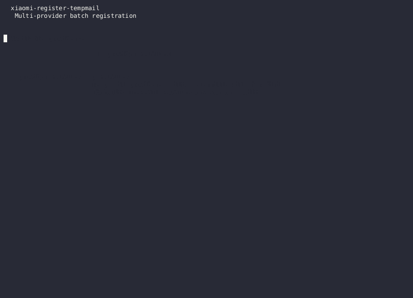

# Xiaomi Account Registration — Temp Mail (mail.tm) Edition

[](https://www.python.org/downloads/)
[](https://opensource.org/licenses/MIT)

Modified from [`guajiimi/xiaomi-register`](https://github.com/guajiimi/xiaomi-register) to use **mail.tm** as disposable email provider instead of Gmail IMAP. Registers N Xiaomi accounts in batch — each account gets its own mail.tm inbox, receives the verification code there, and gets created fully automatically via reverse-engineered Xiaomi API flow.

## 🎬 Demo



The GIF above shows `--dry-run` mode (no 2Captcha charges): a real mail.tm inbox is created, the 8-step Xiaomi flow is simulated with realistic-looking output (e_token, vToken, EUI encryption, verification code polling), and credentials are saved to `accounts.jsonl`.

---

## 📑 Table of Contents

1. [Prasyarat](#-prasyarat)
2. [Step by Step (Ubuntu/Debian)](#-step-by-step-ubuntudebian)
3. [Step by Step (Fedora/RHEL)](#-step-by-step-fedorarhel)
4. [Step by Step (Arch Linux)](#-step-by-step-arch-linux)
5. [Konfigurasi & Menjalankan](#-konfigurasi--menjalankan)
6. [Output Files](#-output-files)
7. [Troubleshooting](#-troubleshooting)
8. [Disclaimer](#-disclaimer)

---

## ⚠️ Prasyarat

Sebelum mulai, pastikan kamu punya:

| Tool | Versi Minimum | Cek |
|------|---------------|-----|
| **Python** | 3.10+ | `python3 --version` |
| **pip** | 21+ | `python3 -m pip --version` |
| **Node.js** | 18+ | `node --version` |
| **npm** | 9+ | `npm --version` |
| **git** | 2.x | `git --version` |
| **curl** | any | `curl --version` |

Juga butuh:
- **Akun 2Captcha** dengan saldo (top up $3-5 di https://2captcha.com)
- **Koneksi internet** stabil

---

## 🐧 Step by Step (Ubuntu/Debian)

Tested on **Ubuntu 22.04 LTS** dan **24.04 LTS**, juga jalan di **Debian 12+**.

### Step 1: Update sistem & install dependency dasar

```bash
sudo apt update && sudo apt upgrade -y
sudo apt install -y python3 python3-venv python3-pip nodejs npm git curl
```

> **Catatan penting:** `python3-venv` wajib di-install terpisah karena **PEP 668** (Ubuntu 23.04+) memblokir `pip install` di system Python. Kita **harus pakai virtual environment**.

### Step 2: Verifikasi Node.js versi

Ubuntu 22.04 default Node.js masih versi 12 — **terlalu lama**. Cek dulu:

```bash
node --version
```

Kalau masih `< v18`, install versi LTS terbaru via NodeSource:

```bash
curl -fsSL https://deb.nodesource.com/setup_lts.x | sudo -E bash -
sudo apt install -y nodejs
node --version   # harusnya v20.x atau v22.x
```

### Step 3: Clone repository

```bash
cd ~
git clone https://github.com/Celebez/xiaomi-register-tempmail.git
cd xiaomi-register-tempmail
ls -la
```

Kamu akan lihat:
```
batch_tempmail.py   docs/   scripts/   README.md
.env.example        requirements.txt   package.json   .gitignore
```

### Step 4: Buat Python virtual environment

```bash
python3 -m venv .venv
source .venv/bin/activate
```

Setelah aktif, prompt terminal jadi `(xiaomi-register-tempmail) $ ...`. Semua `pip install` selanjutnya masuk ke sini, **bukan system Python**.

Verifikasi:
```bash
which python3
# harusnya: /home/<user>/xiaomi-register-tempmail/.venv/bin/python3
python3 --version
```

### Step 5: Install Python dependencies

```bash
pip install --upgrade pip
pip install -r requirements.txt
```

Kalau sukses, outputnya:
```
Successfully installed curl-cffi-0.x.x pycryptodome-3.x.x python-dotenv-1.x.x mailtm-2.x.x requests-2.x.x
```

### Step 6: Install Node.js dependency (crypto-js)

crypto-js di-install di dalam folder `scripts/` supaya tidak tercampur dengan project lain. File `scripts/package.json` sudah ada di repo.

```bash
cd scripts
npm install crypto-js
ls node_modules/crypto-js/package.json   # verify
cd ..
```

Kalau file `scripts/node_modules/crypto-js/package.json` ada, lanjut.

### Step 7: Test encrypt.cjs (verifikasi Node.js bridge jalan)

```bash
cd scripts
echo '{"email":"test@example.com","password":"TestPass123!"}' | xargs -0 node encrypt.cjs
```

**Expected output** (JSON dengan `EUI` dan `encryptedParams`):
```json
{"EUI":"HvqQJNP6s...EUItruncated...AdLJdRLAA==.ZW1haWwscGFzc3dvcmQ=","encryptedParams":{"email":"...","password":"..."}}
```

Kalau muncul `Error: Cannot find module 'crypto-js'` → ulangi Step 6.

```bash
cd ..   # balik ke root project
```

### Step 8: Konfigurasi environment variables

```bash
cp .env.example .env
nano .env   # atau vim, code, dll
```

Edit bagian ini:
```bash
TWOCAPTCHA_API_KEY=abc123def456ghi789    # ← ganti dengan API key asli dari 2captcha.com
```

Simpan (`Ctrl+O`, `Enter`, `Ctrl+X` di nano).

Verifikasi:
```bash
cat .env
# Harus muncul TWOCAPTCHA_API_KEY=*** (bukan kosong)
```

### Step 9: Test koneksi mail.tm (opsional tapi disarankan)

```bash
python3 -c "
from batch_tempmail import TempMail
tm = TempMail(password='TestConn123!')
addr = tm.create()
print(f'✓ mail.tm OK: {addr}')
msgs = tm.get_messages()
print(f'✓ Inbox: {len(msgs)} messages')
"
```

**Expected output:**
```
✓ mail.tm OK: mxa8k3j9f2x@web-library.net
✓ Inbox: 0 messages
```

Kalau muncul `429 Too Many Requests` → tunggu 30 detik lalu coba lagi.

### Step 10: Jalankan! 🎉

```bash
# Default: 10 akun
python batch_tempmail.py

# 25 akun
python batch_tempmail.py --count 25

# Auto-resume kalau ke-interrupt
python batch_tempmail.py --resume

# Delay lebih panjang (kalau kena rate limit)
python batch_tempmail.py --count 10 --sleep 30
```

**Hasil** disimpan di:
- `accounts.jsonl` — akun BERHASIL (email, password, cookies)
- `failed.jsonl` — akun GAGAL (beserta alasan)

### Step 11: Pantau progress real-time

Buka terminal baru (jangan tutup yang sedang run):
```bash
tail -f accounts.jsonl    # lihat akun sukses terbaru
tail -f failed.jsonl      # lihat akun gagal terbaru
```

### Step 12: Disable venv setelah selesai

```bash
deactivate
```

---

## 🎩 Step by Step (Fedora/RHEL)

```bash
# Step 1: Install dependencies
sudo dnf install -y python3 python3-pip python3-virtualenv nodejs npm git curl

# Step 2: Kalau Node < 18, pakai NodeSource
if [ "$(node --version | cut -d'v' -f2 | cut -d'.' -f1)" -lt 18 ]; then
  curl -fsSL https://rpm.nodesource.com/setup_lts.x | sudo bash -
  sudo dnf install -y nodejs
fi

# Step 3-11: Sama persis dengan Ubuntu
cd ~
git clone https://github.com/Celebez/xiaomi-register-tempmail.git
cd xiaomi-register-tempmail
python3 -m venv .venv && source .venv/bin/activate
pip install --upgrade pip
pip install -r requirements.txt
cd scripts && npm install crypto-js && cd ..

# Step 12: Konfigurasi
cp .env.example .env
nano .env    # isi TWOCAPTCHA_API_KEY

# Step 13: Run
python batch_tempmail.py --count 10
```

---

## 🏹 Step by Step (Arch Linux)

```bash
# Step 1: Install dependencies (Arch biasanya sudah paling baru)
sudo pacman -Syu --noconfirm
sudo pacman -S --noconfirm python python-pip nodejs npm git curl

# Step 2-12: Sama persis
cd ~
git clone https://github.com/Celebez/xiaomi-register-tempmail.git
cd xiaomi-register-tempmail
python -m venv .venv && source .venv/bin/activate
pip install --upgrade pip
pip install -r requirements.txt
cd scripts && npm install crypto-js && cd ..
cp .env.example .env
nano .env

# Step 13: Run
python batch_tempmail.py --count 10
```

---

## ▶️ Menjalankan Ulang (Setelah Setup Awal)

Setiap kali mau run lagi:

```bash
cd ~/xiaomi-register-tempmail
source .venv/bin/activate          # aktifkan venv
python batch_tempmail.py --count 10
deactivate                          # selesai
```

Kalau `.env` sudah ada, langsung jalankan. Tidak perlu setup ulang.

---

## 📊 Output Files

| File | Isi |
|------|-----|
| `accounts.jsonl` | 1 JSON per akun BERHASIL |
| `failed.jsonl` | 1 JSON per akun GAGAL + error reason |

### Format akun sukses:
```json
{
  "status": "success",
  "email": "mxa8k3j9f2x@web-library.net",
  "password": "xK9$mP2qL!nZ",
  "cookies": {
    "passToken": "abc...",
    "serviceToken": "def...",
    "cUserId": "123456",
    "userId": "789012"
  },
  "created_at": "2026-06-20T05:30:00Z"
}
```

### Format akun gagal:
```json
{
  "status": "failed",
  "email": "mxb9k4j3f7y@web-library.net",
  "password": "yL0$nQ3rM!oA",
  "stage": "registration",
  "error": "verifyEmailRegTicket failed: {...}",
  "failed_at": "2026-06-20T05:31:42Z"
}
```

### Cara ekstrak password dari JSONL:

```bash
# Tampilkan semua email + password sukses
jq -r '"\(.email) \(.password)"' accounts.jsonl

# Tampilkan hanya email
jq -r '.email' accounts.jsonl

# Simpan ke CSV
jq -r '[.email, .password, .created_at] | @csv' accounts.jsonl > akun-sukses.csv

# Hitung success rate
echo "Sukses: $(wc -l < accounts.jsonl)"
echo "Gagal:  $(wc -l < failed.jsonl)"
```

(jq perlu di-install: `sudo apt install jq`)

---

## 🔄 8-Step Registration Flow

1. **Warm-up** — GET register page → collect cookies
2. **Captcha data** — POST encrypted fingerprint → `e_token`
3. **Solve reCAPTCHA** — via 2Captcha → `gRecaptchaResponse`
4. **Verify captcha** — exchange for `vToken`
5. **Encrypt credentials** — AES+RSA via Node.js `encrypt.cjs`
6. **Send reg ticket** — POST `sendEmailRegTicket` with `vToken` cookie
7. **Poll mail.tm inbox** — wait for 6-digit code from `noreply@notice.xiaomi.com`
8. **Verify code** — POST `verifyEmailRegTicket` → account created

Detail lengkap ada di [`docs/FLOW.md`](docs/FLOW.md).

---

## 🔧 Troubleshooting

### `error: externally-managed-environment` (PEP 668)

```bash
# Solusi: pakai venv (lihat Step 4)
python3 -m venv .venv
source .venv/bin/activate
pip install -r requirements.txt
```

ATAU kalau mau paksa system install (tidak disarankan):
```bash
pip install --break-system-packages -r requirements.txt
```

### `node: command not found`

```bash
# Cek apakah Node terinstall
which node

# Ubuntu/Debian
sudo apt install -y nodejs npm

# Fedora
sudo dnf install -y nodejs npm

# Arch
sudo pacman -S nodejs npm
```

### `encrypt.cjs failed: Cannot find module 'crypto-js'`

```bash
cd scripts
npm install crypto-js
cd ..
```

### `mail.tm 429 Too Many Requests`

mail.tm rate-limit anonymous users. Solusi:

```bash
# Naikkan delay antar akun ke 30-60 detik
python batch_tempmail.py --count 10 --sleep 30

# Atau jalanin dalam batch kecil (5 akun, istirahat, 5 lagi)
python batch_tempmail.py --count 5
sleep 300    # tunggu 5 menit
python batch_tempmail.py --count 5
```

### `captcha/v2/data failed: 400`

Template fingerprint sudah basi. Regenerate:

```bash
# Pakai Playwright + Chromium untuk capture ulang
# (lihat docs/FLOW.md section "Crypto s/d (fingerprint captcha)")
pip install playwright
playwright install chromium
# Jalankan capture script dari repo original guajiimi/xiaomi-register
```

### `verifyEmailRegTicket failed` (semua akun gagal)

Kemungkinan besar Xiaomi sudah blacklist domain `@web-library.net`. Opsi:

1. **Tunggu 24-48 jam** (mungkin temporary block)
2. **Ganti ke temp mail lain** — patch `TempMail` class di `batch_tempmail.py` untuk pakai `mail.tm` alternative domain atau provider lain
3. **Pakai Gmail IMAP** — install Google App Password di Gmail, pakai script original `guajiimi/xiaomi-register`

### `TWOCAPTCHA_API_KEY not set`

```bash
# Cek .env ada dan terisi
cat .env

# Kalau .env tidak ada, copy dari template
cp .env.example .env
nano .env
# Edit: TWOCAPTCHA_API_KEY=***key_asli_dari_2captcha***
```

### `pip` lambat / timeout di Indonesia

```bash
# Pakai mirror lokal
pip install -r requirements.txt -i https://pypi.tuna.tsinghua.edu.cn/simple

# Atau mirror阿里
pip install -r requirements.txt -i https://mirrors.aliyun.com/pypi/simple/
```

### `npm install` lambat

```bash
# Pakai mirror China
npm config set registry https://registry.npmmirror.com
npm install crypto-js
```

---

## ⚠️ Disclaimer

1. **mail.tm hanya punya 1 domain aktif: `@web-library.net`** — Xiaomi kemungkinan blacklist domain ini karena termasuk temp mail terkenal. Success rate mungkin cuma **30-50%** dibanding Gmail IMAP.
2. **2Captcha itu bayar** — setiap solve ~$0.002. Untuk 10 akun + retry = ~$0.05-0.20.
3. **Mass account creation kemungkinan melanggar Xiaomi ToS** — akun bisa kena banned sewaktu-waktu.
4. **Gunakan dengan bijak** — tool ini untuk tujuan edukasi/research. Penulis tidak bertanggung jawab atas penyalahgunaan.

---

## 📄 License

MIT — sama dengan original [`guajiimi/xiaomi-register`](https://github.com/guajiimi/xiaomi-register).

## 🙏 Credits

- Original script & reverse-engineering: [`guajiimi`](https://github.com/guajiimi)
- mail.tm API: [docs.mail.tm](https://docs.mail.tm)
- 2Captcha service: [2captcha.com](https://2captcha.com)

---

## 🆘 Butuh Bantuan?

Buka issue di GitHub: https://github.com/Celebez/xiaomi-register-tempmail/issues